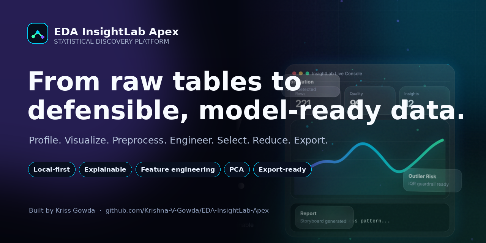
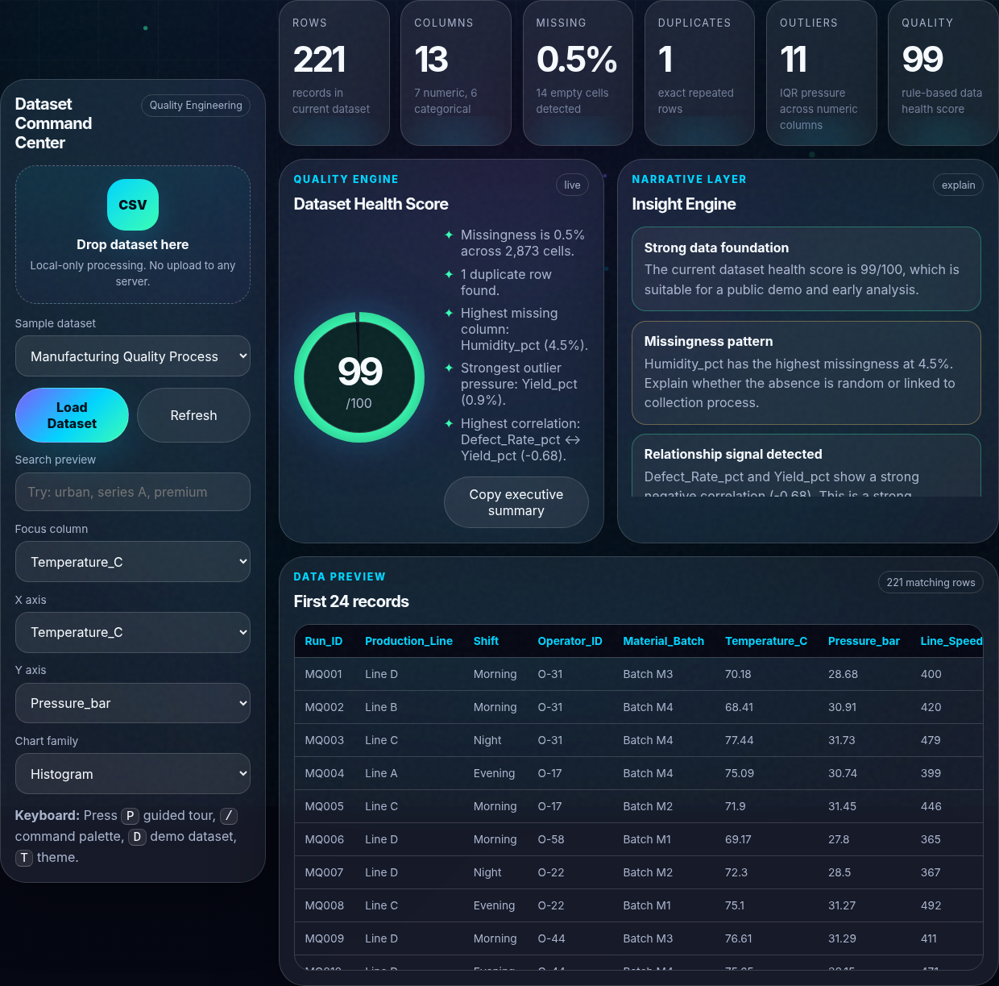
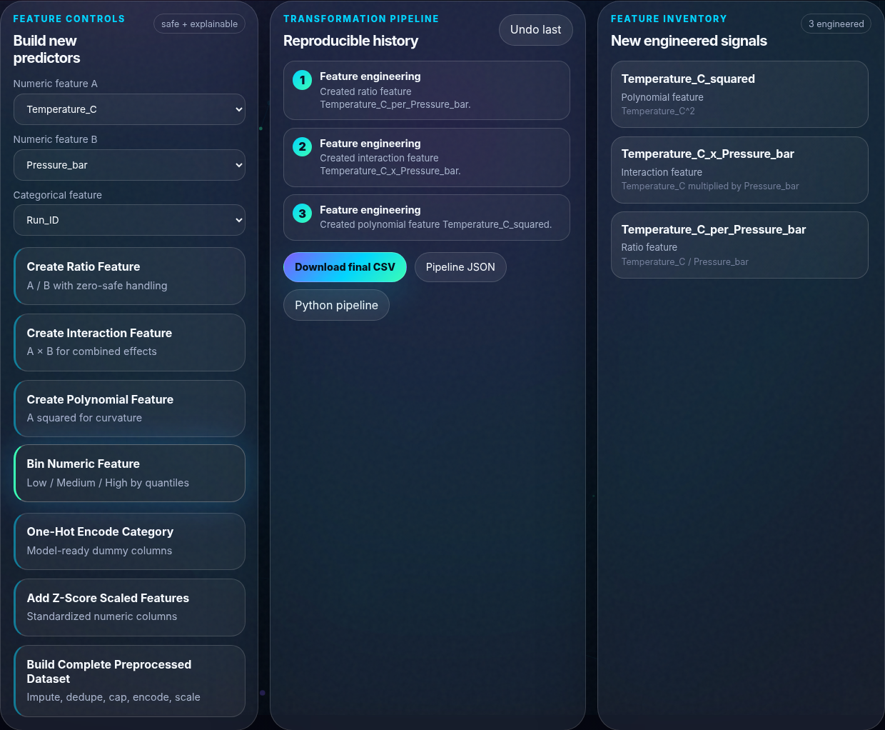
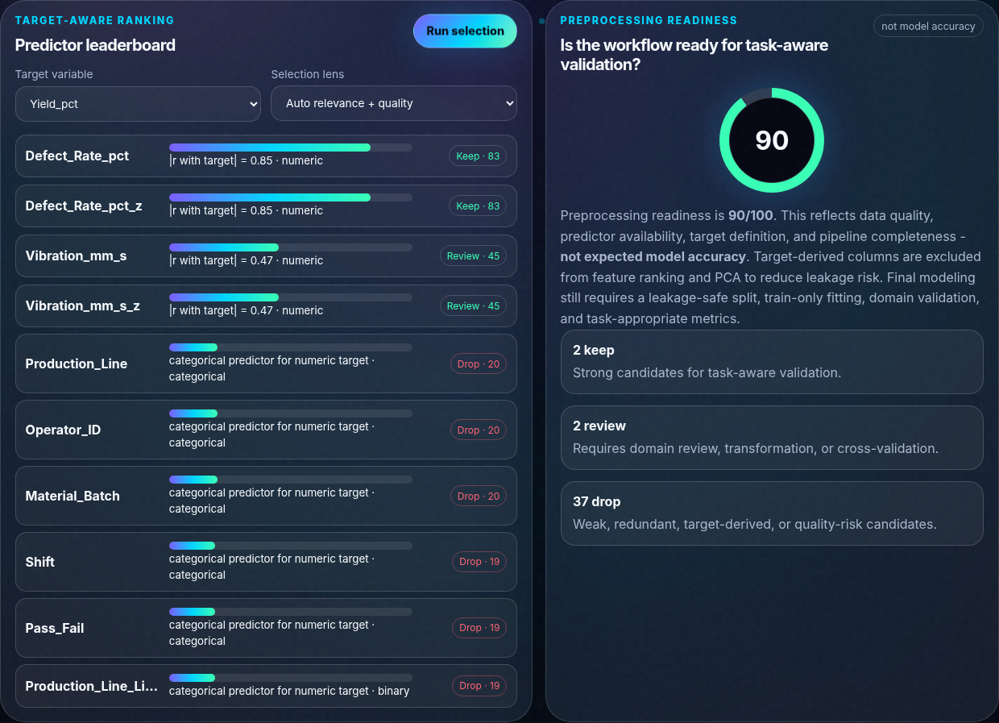
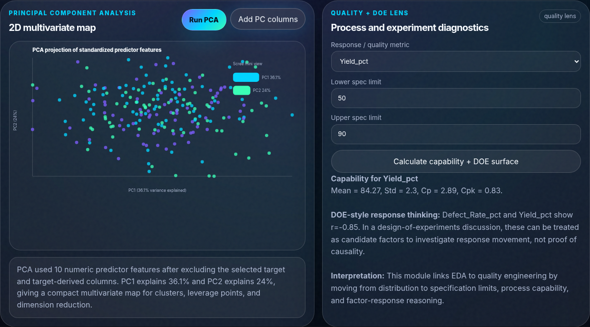
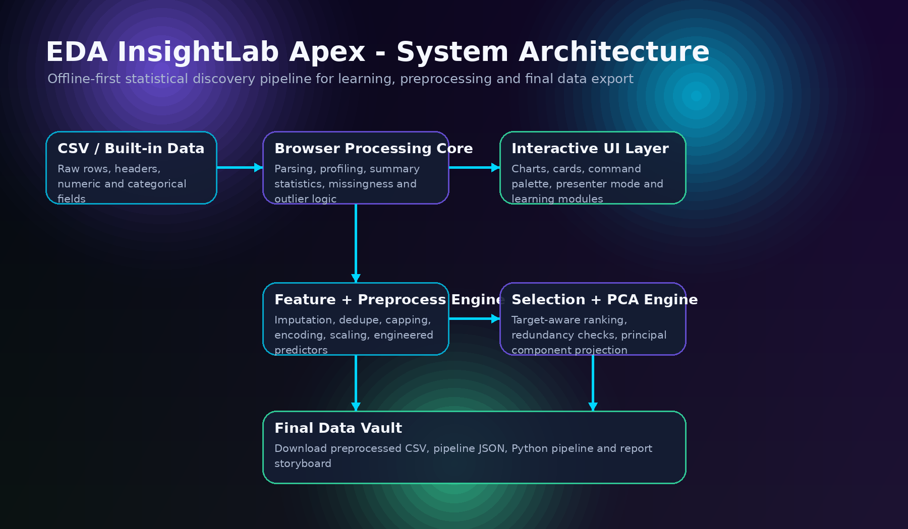

<p align="center">
  
</p>

<p align="center">
  <a href="https://krishna-v-gowda.github.io/EDA-InsightLab-Apex/"><strong>Launch the live product</strong></a>
  ·
  <a href="docs/EDA_InsightLab_Apex_Product_Deck.pdf"><strong>View the product deck</strong></a>
  ·
  <a href="docs/DEMO_GUIDE.md"><strong>Run the guided demo</strong></a>
</p>

<p align="center">
  
  
  
  
  
</p>

# EDA InsightLab Apex

**EDA InsightLab Apex is a local-first statistical discovery platform that turns raw tabular data into an explainable, exportable analytical workflow.** It brings profiling, visual diagnostics, preprocessing, feature engineering, target-aware feature selection, principal component analysis, quality reasoning, and final data export into one browser application.

The product is built around a simple principle:

> **Do not rush from raw data to a model. First make the data understandable, defensible, and reproducible.**

## Product at a glance

| Discover | Prepare | Engineer | Reduce | Deliver |
|---|---|---|---|---|
| Schema, missingness, duplicates, distributions, correlations | Imputation, deduplication, IQR guardrails, encoding, scaling | Ratios, interactions, polynomial signals, bins, one-hot and z-score features | Target-aware ranking and PCA | Processed CSV, pipeline JSON, Python code, analysis storyboard |

<p align="center">
  
  
</p>
<p align="center">
  
  
</p>

## Why it exists

Exploratory analysis is often fragmented across notebooks, one-off scripts, spreadsheets, and disconnected visualizations. That makes the reasoning difficult to follow and transformations difficult to reproduce. EDA InsightLab Apex turns the journey into a visible sequence:

```text
Raw CSV
  -> profile structure and data quality
  -> explore distributions and relationships
  -> clean with explicit rationale
  -> engineer domain-relevant signals
  -> rank predictors with leakage guards
  -> reduce correlated numeric dimensions with PCA
  -> export data, code, pipeline metadata, and narrative
```

## Core capabilities

### 1. Data Command Center
- CSV upload with local browser processing
- Built-in manufacturing, experimental-design, retail, startup, and student datasets
- Schema inference for numeric, categorical, binary, and identifier columns
- Missing-value, duplicate, cardinality, distribution, and outlier diagnostics
- Transparent data-health indicator with explicit limitations

### 2. Interactive visual diagnostics
- Histograms, box plots, scatter plots, bar charts, and line charts
- Correlation heatmap and missingness map
- Hover-level explanations and interpretation captions
- Searchable data preview and column-level profiles

### 3. Explainable preprocessing
- Numeric median and categorical mode imputation
- Exact-row deduplication
- IQR-based outlier capping as an optional guardrail
- Low-cardinality one-hot encoding for predictors
- Standardized predictor features
- Protected target variable to reduce target leakage risk

### 4. Feature Engineering Lab
- Ratio features
- Interaction features
- Squared/polynomial features
- Numeric bins
- One-hot encoded predictors
- Z-score features
- Transformation inventory and undoable workflow history

### 5. Feature Selection Observatory
- Automatic preferred target for each built-in dataset
- Pearson correlation for numeric-to-numeric relevance
- Eta-squared for numeric predictors against categorical targets
- Cramer's V for categorical associations
- Missingness, low-variance, and redundancy penalties
- Explicit keep/review/drop recommendations
- Exclusion of the target and target-derived features from predictor ranking

### 6. PCA workspace
- Standardization before covariance analysis
- Power-iteration approximation for the first two principal components
- Explained-variance indicators
- PC1/PC2 projection and optional export
- Target and target-derived columns excluded from PCA inputs

### 7. Final Data Vault
- Final processed CSV download
- Transformation pipeline JSON
- Generated, leakage-aware Python preprocessing template
- Analysis storyboard export
- Processed-data preview and readiness caveats

## Live demo

Open the deployed product:

**https://krishna-v-gowda.github.io/EDA-InsightLab-Apex/**

For the strongest walkthrough:

1. Load **Manufacturing Quality Process**.
2. Review data health, missingness, outliers, and correlations.
3. Create a ratio or interaction feature.
4. Build the complete processed dataset.
5. Run feature selection with `Yield_pct` as the target.
6. Run PCA and add PC columns.
7. Export the processed CSV and pipeline JSON.

A full script is available in [`docs/DEMO_GUIDE.md`](docs/DEMO_GUIDE.md).

## Architecture

<p align="center">
  
</p>

The current release is a **zero-backend static web application**. CSV data is parsed, profiled, visualized, transformed, and exported in the user's browser. No dataset is sent to a project-owned server.

```text
Browser UI
  -> local CSV parser
  -> schema and profile engine
  -> SVG visualization layer
  -> preprocessing and feature pipeline
  -> selection and PCA modules
  -> local downloads
```

See [`docs/ARCHITECTURE.md`](docs/ARCHITECTURE.md) for component-level details.

## Quick start

### Option A - open directly

Download the repository and double-click `index.html`.

### Option B - serve locally

```bash
python -m http.server 8000
```

Then open:

```text
http://localhost:8000
```

No package installation, API key, database, or backend is required.

## Repository structure

```text
EDA-InsightLab-Apex/
├── index.html                    # Product entry point
├── assets/
│   ├── brand/                    # Visual identity and social preview
│   ├── css/styles.css            # Responsive product design system
│   ├── js/app.js                 # Data, statistics, UI, and export logic
│   ├── diagrams/                 # Architecture and workflow visuals
│   └── screenshots/              # Verified product views
├── datasets/                     # Demonstration CSV files
├── docs/                         # Architecture, methodology, demo, deck
├── scripts/verify_public_build.py
├── .github/workflows/            # Quality checks and Pages deployment
├── CHANGELOG.md
├── ROADMAP.md
├── CONTRIBUTING.md
├── SECURITY.md
└── LICENSE
```

## Methodology and responsible interpretation

The product deliberately distinguishes between **working workflow features** and **production-grade statistical validation**.

- The health score and feature-readiness score are transparent heuristics, not scientific guarantees.
- Correlation describes association, not causation.
- IQR flags are diagnostics; they do not prove that a value should be removed.
- Feature selection is a fast, explainable screening layer and should be followed by domain review and cross-validation.
- PCA is calculated on standardized numeric predictors and is intended for exploration and dimensional compression.
- Final model development still requires a leakage-safe train/validation/test strategy, train-only fitting, suitable metrics, and monitoring.

Read the full method notes in [`docs/METHODOLOGY.md`](docs/METHODOLOGY.md) and limitations in [`docs/PRIVACY_AND_LIMITATIONS.md`](docs/PRIVACY_AND_LIMITATIONS.md).

## Privacy

The current version is local-first: uploaded CSV data remains in the browser tab. The project does not include analytics trackers, authentication, cloud persistence, or a project-owned data API. Users should still avoid loading confidential data on an untrusted device and should review downloaded artifacts before sharing them.

## Quality assurance

The repository includes automated public-build checks for:

- required product files;
- broken local asset references;
- public-copy scans for removed academic branding;
- basic accessibility and metadata requirements;
- file-size guardrails;
- JavaScript syntax validation in GitHub Actions.

Run locally:

```bash
python scripts/verify_public_build.py
node --check assets/js/app.js
```

## Roadmap

Planned directions include:

- validated server-side statistics for larger datasets;
- schema contracts and dataset versioning;
- leakage-safe train/test workflow automation;
- anomaly detection and model baselines;
- explainable AI copilot grounded in computed statistics;
- project workspaces, audit logs, and collaboration;
- automated tests against reference statistical libraries.

See [`ROADMAP.md`](ROADMAP.md) for the staged plan.

## Contributing

Thoughtful issues, reproducible bug reports, documentation improvements, and well-scoped pull requests are welcome. Start with [`CONTRIBUTING.md`](CONTRIBUTING.md) and review the [`CODE_OF_CONDUCT.md`](CODE_OF_CONDUCT.md).

## Author

**Kriss Gowda**  
Building intelligent products that turn ambitious ideas into real-world impact.

- GitHub: [@Krishna-V-Gowda](https://github.com/Krishna-V-Gowda)
- Product: [EDA InsightLab Apex](https://krishna-v-gowda.github.io/EDA-InsightLab-Apex/)

## License

Released under the [MIT License](LICENSE).
